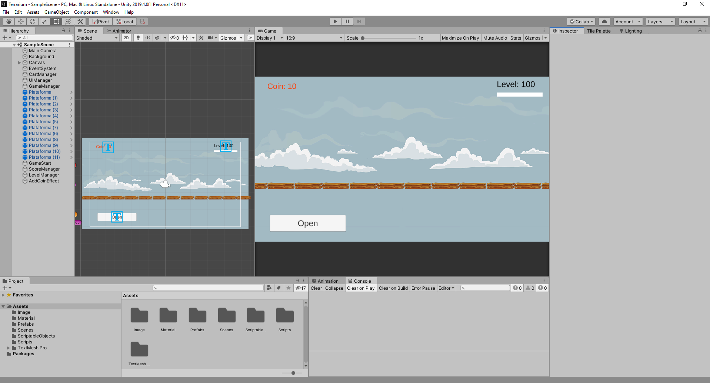

# Terrarium Clone

Refazendo as mecânicas principais do jogo Terrarium utilizando a engine Unity colocando em prática padrão de projeto Observer estáticos para desacoplar os códigos e usando scriptableObjects para armazenar dados.
As mecânicas foram feitas em menos de 5h
